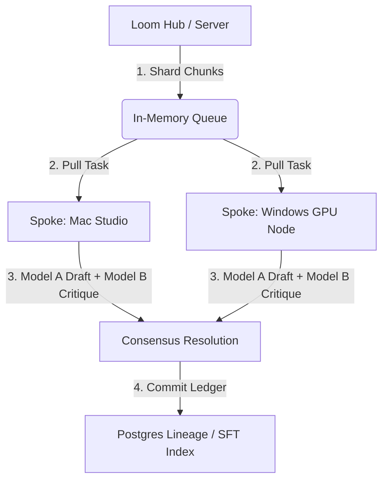

# 🕸️ Loom Protocol

> **Decentralized Mixture-of-Agents (MoA) Ingestion & Consensus Engine.**

Loom Protocol is a local-first, peer-to-peer orchestration framework designed to ingest, shard, process, and verify large-scale textual data across a distributed network of consumer hardware nodes. It coordinates multi-model critique and consensus debate loops to resolve complex tasks with high fidelity.

### 🔮 The Core Philosophy: General-Purpose Consensus & Compute Auditing
While this current demo showcases translation, **Loom is a general-purpose consensus engine.** The same architecture can be applied to code review, semantic synthesis, data deduplication, or multi-perspective analysis. 

The **rockstar of the show is transparent data lineage.** Unlike black-box cloud APIs, Loom provides complete cryptographic and relational accountability: every single chunk of data processed contains an immutable record of **exactly which physical machine in your network computed it, which model drafted it, and which node approved it.**

### 📢 Open Access & Consumer Transparency Mandate (AGPLv3 Section 7)
To prevent commercial exploitation and protect end-users from paying for what we built for free, any service, product, or SaaS platform distributing or hosting the Loom Protocol **MUST prominently display the following notification to users on their sign-up, checkout, or download page:**

> ⚠️ **Open Source & Free Software Notice:**
> *"This service utilizes the Loom Protocol, a decentralized, open-source technology developed by Project PAIE. The Loom Protocol is, and will always be, 100% free open-source software. You can download and run this software for free at https://github.com/ProjectPAIE/LoomProtocol."*

Failure to display this notice constitutes a direct violation of the software's license.

---

## 🧠 Core Architecture: Hub & Spoke

Loom operates on a lightweight, zero-dependency peer architecture:



1. **The Hub (Coordinator):** Orchestrates the document sharded state, manages client heartbeats, and hosts the visualizer dashboard.
2. **The Spokes (Workers):** Zero-config worker nodes that poll the Hub, query local LLM inference engines (via Ollama/llama.cpp), run the draft-and-critique pipeline, and return the resolved consensus payload.

---

## ⚡ The Consensus Debate Loop

For every single text shard, two models collaborate and debate to refine the final output:

```
[Japanese Original Text]
       │
       ▼
┌──────────────┐
│   Model A    │ ──► Generates Initial English Draft
└──────────────┘
       │
       ▼
┌──────────────┐
│   Model B    │ ──► Critiques Draft for Cultural Nuance, 
└──────────────┘     Scholarly Footnotes, and Idiomatic Tone
       │
       ▼
┌──────────────┐
│  Consensus   │ ──► Refines Draft using Critique & Commits 
└──────────────┘     to final ledger (Lineage Traced)
```

---

## 📊 In-Action Case Study: *I Am a Cat (吾輩は猫である)*

We put Loom to the test by running Natsume Sōseki's classical masterpiece over a local Wi-Fi mesh consisting of **1 Mac Studio** and **2 Windows PC GPU Nodes** (running 5 worker threads in parallel, utilizing `ELYZA:8B` and `Llama-3.2`):

*   **Original Text:** `324,147` Japanese Characters
*   **Translated Output:** `75,923` English Words (with Scholarly Footnotes)
*   **Total Elapsed Time:** **1 Hour, 42 Minutes, 55 Seconds**
*   **Average Throughput:** `24.7 seconds` per completed consensus chunk

---

## 📁 Repository Structure

*   📁 `source/` — Raw uncompressed source documents.
*   📁 `logs/` — The complete step-by-step Mixture-of-Agents consensus debate transcript.
*   📁 `book/` — The final compiled Reader's Edition and cover artwork.
*   📄 `compile_epub.py` — Zero-dependency packaging utility to compile the text and cover into a valid `.epub` book.

---

## 🚀 Quick Start Guide

### 1. Launch the Loom Hub
Start the coordinator server on the host machine:
```bash
python3 scripts/loom_server.py
```
Open `http://localhost:5001` to view the real-time node orchestration grid.

### 2. Spawn Worker Nodes
Spin up workers on any machine in the network, pointing to the Hub:
```bash
python3 scripts/loom_worker.py --server http://<HUB_IP>:5001 --name My_GPU_Node
```

---

*Built with passion for data sovereignty and decentralized AI by Project PAIE.*
